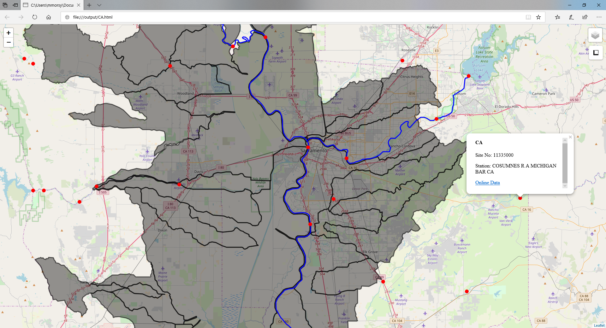

# html-maps

[Click here for an example html-map](https://htmlpreview.github.io/?https://github.com/Dewberry/html-maps/blob/master/docs/map.html)

---




## Description
HTML maps is a tool that simplifies the development of lightweight and interactive maps utilizing the python visualization library [folium](https://github.com/python-visualization/folium). To generate these interactive maps we are using the Python IDE [jupyter notebooks](https://jupyter.org/) to process geo-spatial data such as:
1. USGS gauges  
2. Hydrologic Model data    
3. Meteorological data

**NOTE* : Currently the add functions are expecting geopandas.GeoDataFrames inputs.  

---
## Contents  
#### Notebooks:  
 * [QuickMap-PM](/notebooks/QuickMap-PM.ipynb) - The control notebook for papermill to auto-generate html maps.
 * [QuickMap](/notebooks/QuickMap.ipynb)  - Papermill notebook controlled by the QuickMap-PM notebook.
 * [Example](/notebooks/example.ipynb)  - Example notebook describing the process of initializing HTML maps.

#### Html-Maps:
 * mapfun.py - Library to generate interactive maps.
 * features.py - Library to auto-generate html tables.  
 * [HTML.py](http://www.decalage.info/python/html) - Libary developed by Philippe Lagadec to write html tables in python. 

#### Sample data:
 Contains point, line, and polygon data for use with the example notebook. These data files are in geojson and shapefile.   
 * sample_gages.geojson  
 * sample_gages.shp  
 * sample_lines.geojson  
 * sample_lines.shp  
 * sample_polygons.geojson   
 * sample_polygons.shp   
 
---
## Workflow
1. Initialize html map by inputting the center of the location (x,y).     
```  
m = mapfun(longitude,latitude)
```   
2. Add data to the html map.   
```
m.add_polygon(polygons, descriptions, name of polygon, add_table=True)
```  
3. Save map.   
```
m.map.save(outfile='map.html')
```
---
### Documentation       
[mapfun](docs/mapfun.md)    
[features](docs/features.md)   
<br>  

